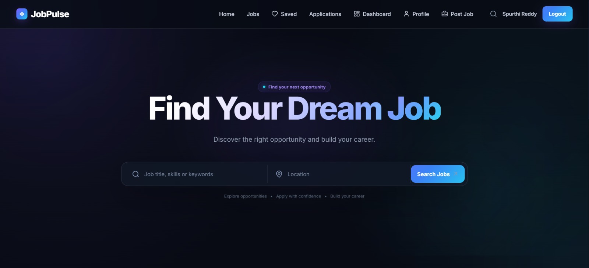
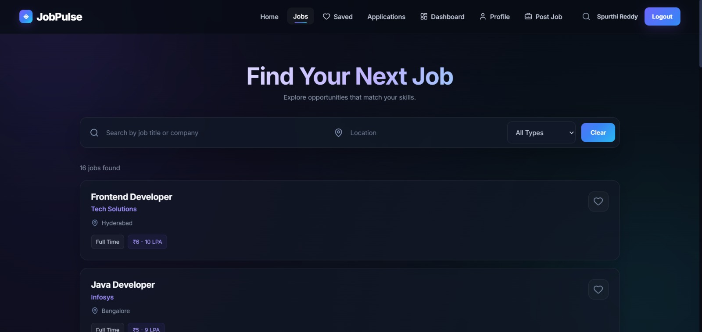
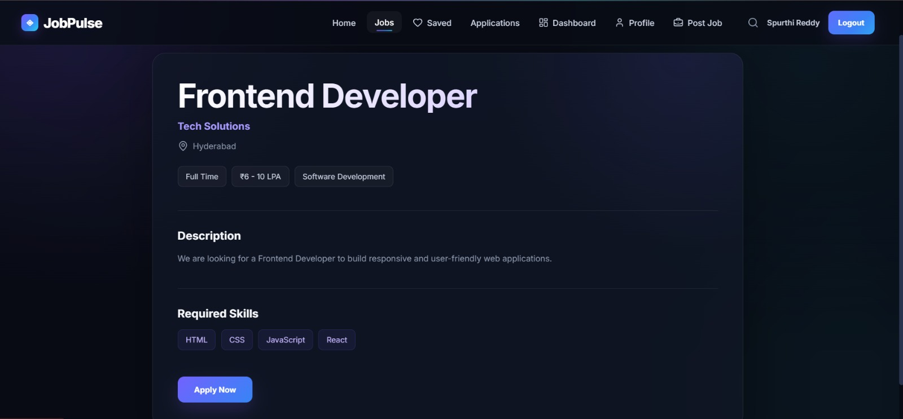
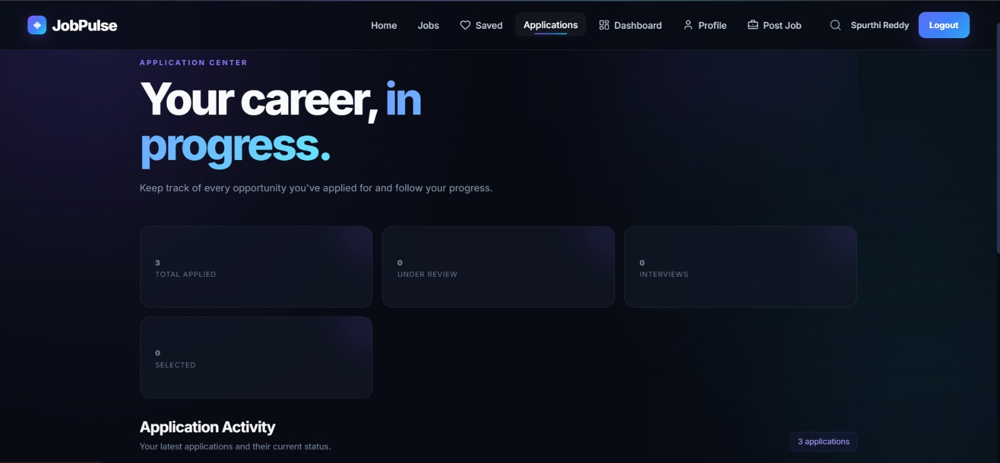
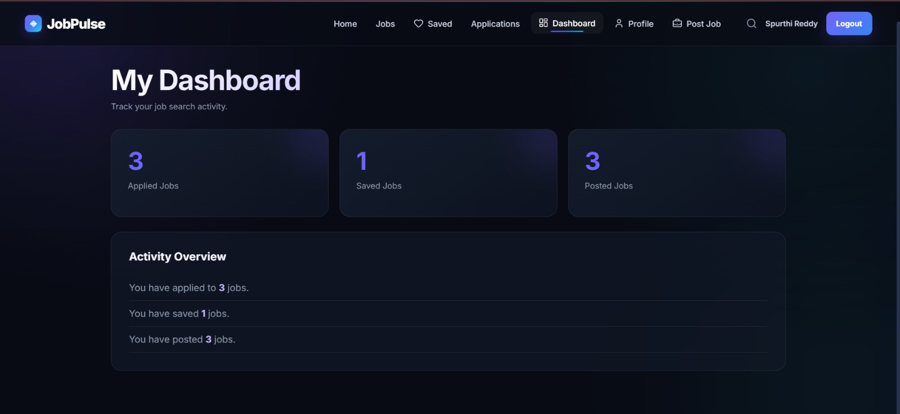
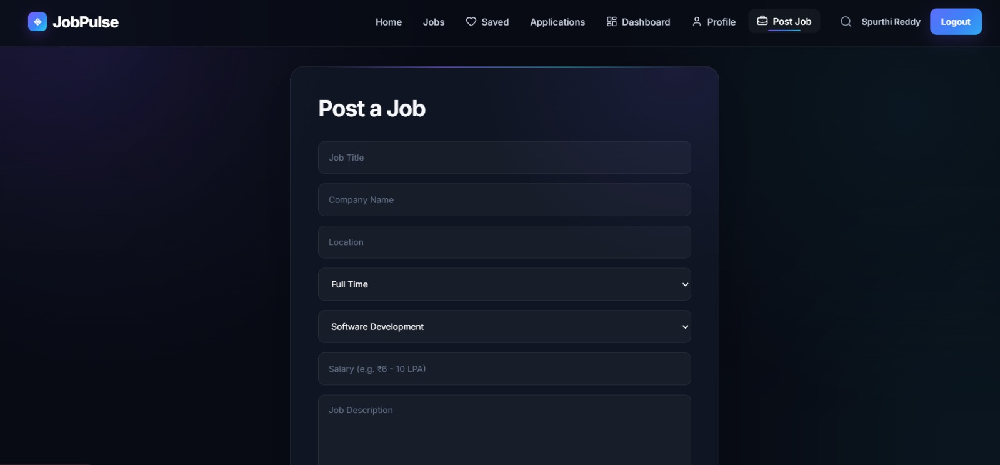

# JobPulse

A modern React-based job portal that helps users discover jobs, save opportunities, apply for positions, manage their profiles, and track applications.

## Features

- Auth0 authentication
- Job search and filtering
- Location-based job search
- Save and remove jobs
- Job details and application flow
- Application tracking
- User profile management
- Post new job opportunities
- User dashboard
- User-specific LocalStorage data
- Responsive design
- Modern dark SaaS-style UI

## Tech Stack

- React.js
- JavaScript
- React Router
- Auth0
- HTML5
- CSS3
- Lucide React
- LocalStorage
- Vite

## Project Structure

```text
src/
├── Components/
│   ├── Nav.jsx
│   └── ProtectedRoute.jsx
│
├── Pages/
│   ├── Home.jsx
│   ├── Jobs.jsx
│   ├── JobDetails.jsx
│   ├── Apply.jsx
│   ├── Applications.jsx
│   ├── SavedJobs.jsx
│   ├── Profile.jsx
│   ├── PostJob.jsx
│   └── Dashboard.jsx
│
├── App.jsx
├── App.css
├── index.css
└── main.jsx
```

## Screenshots

### Home


### Jobs


### Job Details


### Applications


### Dashboard


### Post a Job


## Authentication

JobPulse uses Auth0 for user authentication.

Protected features include:

- Saved Jobs
- Applications
- Profile
- Dashboard
- Post Job
- Apply

User-specific application, profile, saved-job and posted-job data is maintained using LocalStorage.

## Getting Started

### 1. Clone the repository

```bash
git clone https://github.com/spurthibojja/job-pulse.git
```

### 2. Navigate to the project

```bash
cd job-pulse
```

### 3. Install dependencies

```bash
npm install
```

### 4. Configure Auth0

Create a `.env` file in the project root:

```env
VITE_AUTH0_DOMAIN=YOUR_AUTH0_DOMAIN
VITE_AUTH0_CLIENT_ID=YOUR_AUTH0_CLIENT_ID
```

### 5. Start the development server

```bash
npm run dev
```

## Future Improvements

- Backend integration
- Real job listings API
- Database integration
- Resume upload and storage
- Recruiter management
- Advanced job recommendations
- Deployment

## Author

**Spurthi Bojja**

GitHub: https://github.com/spurthibojja